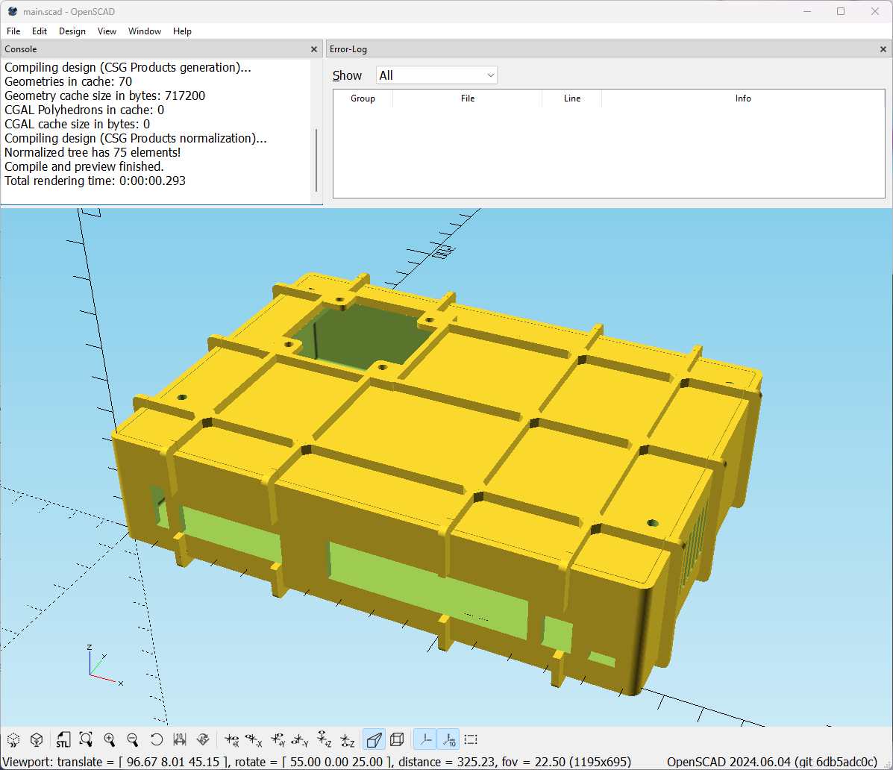

# BPI-R4.scad
A 3D printable WiFiless Banana Pi R4 case designed with OpenSCAD (WIP)

## BOM
1. Single head hexagonal copper pillar, M3 * 6mm + 6mm head, x4
1. Double pass copper pillar, M3 * 25mm, x4
1. Screw, M3 * 6mm, x4
1. Heatsink, atmost ~20mm, x1
1. 4010 fan and screws, x1

## Screenshot

